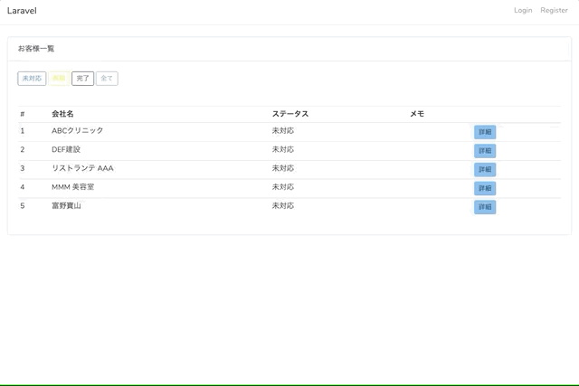

# フリーランス向け簡易コールセンターシステム

### 概要
ブラウザ上から、登録したリストにそって営業電話をかけることができるシステムです。    
通話内容は全て録音されるので後から聞いて営業電話の内容を確認することができます。    
エンジニア、デザイナーさんなどのクリエイターが、電話営業をフリーランスに委託した場合などの管理に利用できます。


### 主な機能
- 営業対象リストの表示
- リストから対象を選択して、ブラウザからお客様に電話
- 通話内容の録音
- 通話ステータス(未対応、保留、完了)の登録
- 通話メモの入力



### 使用している技術
- PHP7/Laravel
- twilio (web上で電話をかけるためのクラウドサービス)

### twilioとは?
twilioは電話の機能を簡単にアプリやウェブサイトに組み込むことができるAPIです。    
料金は、5円/分程度です。    
[料金表](https://cloudapi.kddi-web.com/price/)    


### 利用方法

1. twilioのアカウントを作成し、電話番号を取得してください。   
以下のページの最初のTwilio電話番号を取得までやればOKです。    
https://jp.twilio.com/docs/usage/tutorials/how-to-use-your-free-trial-account

2. twilioのプロジェクトを作成します    
以下のサイトにアクセスし、FRIENDLY NAMEに任意の名前を設定し[Create]をクリックします。    
https://www.twilio.com/console/voice/twiml/apps/create

2. レポジトリをクローンします
    ```
    $ git clone https://github.com/shrft/sales-call-manager
    ```

3. レポジトリ配下に移動しセットアップを実行します
    ```
    $ cd sales-call-manager
    $ cp .env.example .env
    $ composer install
    $ npm install
    $ npm run dev
    ```

4. .envファイルの中身を更新します。     
書き換えるところは.envファイルを見てください。    

7. アプリケーションキーの生成
    ```
    php artisan key:generate
    ```
5. databaseの作成    
callcenterという名称でデータベースを作成してください。    
.envのDB_DATABASEをcallcenterから変更した場合はその名前で作成してください。

6. テーブルの作成とサンプルデータの作成
    ```
    php artisan migrate
    php artisan db:seed
    ```
7. サーバーの起動
    ```
    php artisan serve --host=127.0.0.1
    ```
8. 以下にアクセスしてお客様一覧が表示されることを確認    
http://127.0.0.1:8000/call-list
9. 外部からアプリケーションにアクセスできるようにする
    ```
    ngrok http -region=jp 8000
    ```

10. twilioのプロジェクトページを開く    
https://www.twilio.com/console/voice/twiml/apps
11. コールバックURLを設定し[SAVE]をクリック    
 Voice->REQUEST_URLの欄に以下を設定    
 `https://[ngrokのURL]/twilio/call`    
 上記のURLはngrok実行時に表示されます。httpsのほうを入力してください。
    ```
    Forwarding http://abcdefg.jp.ngrok.io -> http://localhost:8000 
    Forwarding https://abcdefg.jp.ngrok.io -> http://localhost:8000 
    ```

12. 以下のURLにアクセスし、任意の電話番号を入力し、電話をかけるボタンをおします    
https://[ngrokのURL]/call-list/1    
電話番号は国際番号つきで入力してください。    
例: 080-0000-0000 にかける場合 => 818000000000    
＊ トライアルアカウントだと電話の最初に英語のメッセージが流れる。無視でOK。

13. 録音を聞いてみる    
以下にアクセスして再生ボタンをクリックしてみてください。
https://www.twilio.com/console/voice/dashboard


＊ ngrok経由だと動作が重くてうまく動かない場合があります。    
そういった場合は、何度もreloadすればうまくいきます。