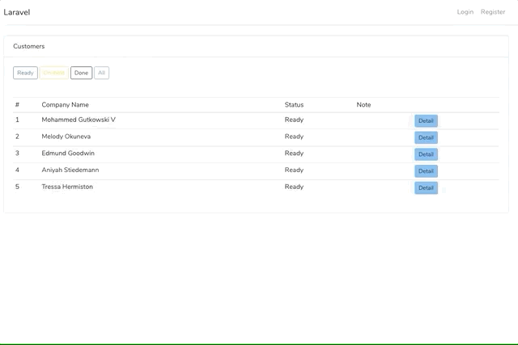

# Telesales tool for small business

### Description
Dead simple telesales/inside sales tool for small business.


### Features
- Show customer list
- Call customers from browser
- record conversation
- add note to remember the conversation 
- and more



### Technology
- PHP7/Laravel
- twilio 

### What is Twilio?
Simply put, Twilio is a developer platform for communications. 
This tool use Twilio to make a call to customers.

[Price](https://www.twilio.com/voice/pricing/us)    


### Getting Started

1. Create a Twilio account and get your phone number.    
follow tutorial below to get your phone number.  
https://www.twilio.com/docs/usage/tutorials/how-to-use-your-free-trial-account

2. Create a Twilio project. 
Visit the site below, fill FRIENDLY NAME  with your desired name, then click Create.
https://www.twilio.com/console/voice/twiml/apps/create

2. Clone this repo.
    ```
    $ git clone https://github.com/shrft/sales-call-manager
    ```

3. Execute the following commands to setup.
    ```
    $ cd sales-call-manager
    $ cp .env.example .env
    $ composer install
    $ npm install
    $ npm run dev
    ```

4. Update .env     

7. Generate app key.
    ```
    php artisan key:generate
    ```
5. Create a database with a name 'callcenter'.    
If you change DB_DATABASE in .env, create a database with that name.

6. Create tables and sample data.
    ```
    php artisan migrate
    php artisan db:seed
    ```
7. Launch a server.
    ```
    php artisan serve --host=127.0.0.1
    ```
8. Visit below and see if customer list is shown.    
http://127.0.0.1:8000/call-list
9. Expose the application to the internet.
    ```
    ngrok http 8000
    ```

10. Open twilio's project page.    
https://www.twilio.com/console/voice/twiml/apps
11. Update REQUEST_URL with ngrok url and then click SAVE.    
 `https://[ngrok URL]/twilio/call`    
 Your ngrok url should be shown after you run ngrok command you have run above.
    ```
    Forwarding http://abcdefg.jp.ngrok.io -> http://localhost:8000 
    Forwarding https://abcdefg.jp.ngrok.io -> http://localhost:8000 
    ```

12. Visit the url below and input a phone number and click Call.    
https://[ngrokのURL]/call-list/1    
Phone numbers should be formatted with a '+' and country code e.g., +16175551212 (E.164 format)

13. You can listen to the recorded conversation from the url below.    
https://www.twilio.com/console/voice/dashboard


### Nothing happens when you click call button?
It may be due to slow page load.    
You can try restart ngrok. When you do, you may set region as below.    
Please change [jp] to your location.    
```ngrok http -region=jp 8000```    
If above does not solve your problem, reload page a few times.